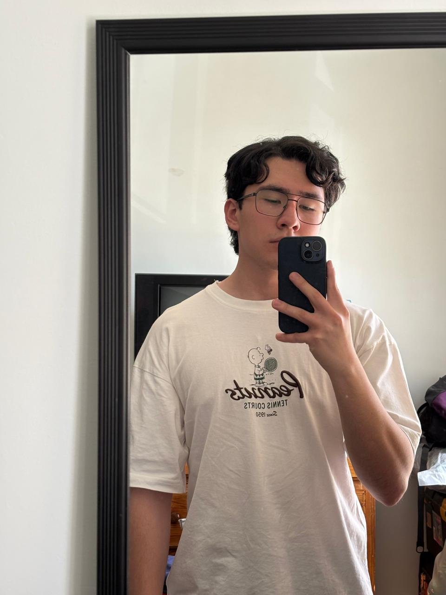

<html lang="en">
<head>
    <meta charset="UTF-8">
    <meta name="viewport" content="width=device-width, initial-scale=1.0">
    <title>Parcial 1 Rangel_Vazquez</title>
</head>
<body>

    <h1>Prueba parcial 1</h1>
    <h2>Luis Adrián Rangel Vázquez</h2>
    <h3>UTD </h3>
    

    <button>Consultar Diagramas de flujo</button>    
    <button>Consultar Diagramas UML </button>
    

    

</body>
</html>
